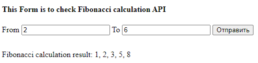
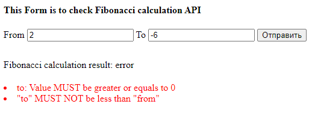

## Fibonacci

Сервис рассчитывает срез последовательности чисел из ряда Фибоначчи 
используя Redis для кэширования ранее рассчитаных значений.

* Для расчета используется API GET запрос http://localhost:8080/fibonacci?from=2&to=6
* Для проверки работы сервиса доступен простой UI http://localhost:8080

## Установка

* Склонировать репозиторий `git clone https://github.com/TimGa/fibonacci.git`
* Развернуть проект `cd fibonacci && docker-compose up -d`
* Установить зависимости `docker-compose exec php composer install`
* Открыть UI http://localhost:8080

## Пример корректного рассчета

API http://localhost:8080/fibonacci?from=2&to=6

## Пример некорректных данных от пользователя

API http://localhost:8080/fibonacci?from=2&to=-6

